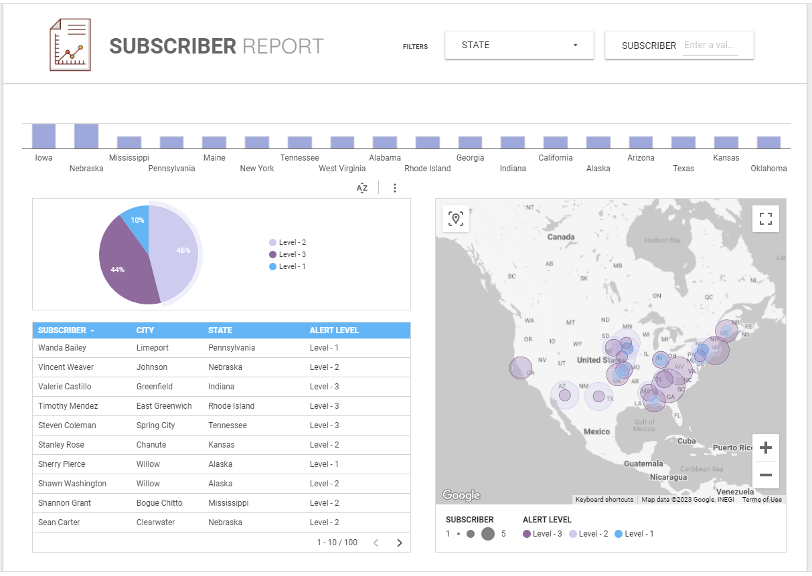

## Profile Summary

An IT professional with extensive experience from different industries who aims to make a positive change.
Recognized for the ability to build relationships with key personnel using profound communication skills that lead and inspire the team and company.

[Link to Resume](https://drive.google.com/file/d/1nwgmD_oLFdUNI-lavPyt5yMc-PU3tIyr/view?usp=sharing)

## Skill
| Type | Description |
| ---      | ---       |
| Hard  | Google Sheet, Excel, MySQL, Looker Studio, Power BI, Python, JavaScript, Adobe Photoshop  |
| Soft  | Adaptive, Critical thinking, Relationship Builder, Leadership, Project Management, Attention to details  |

## Sample Works

  
Subscriber Report Dashboard

 
  ### Overview
  [Link Here](https://lookerstudio.google.com/reporting/c085222c-25ec-4874-aa92-b92bcbaa3f00/page/GKZWD)
  
  <picture>
    
  </picture>

